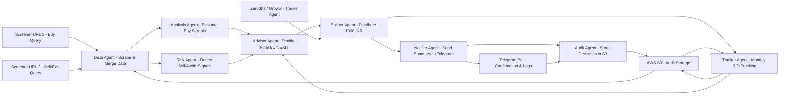
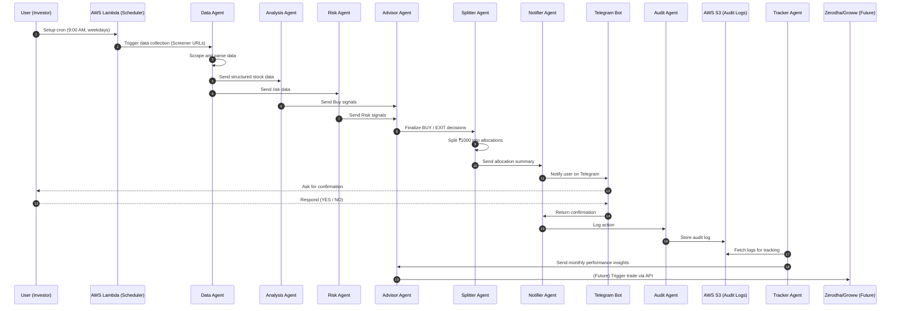
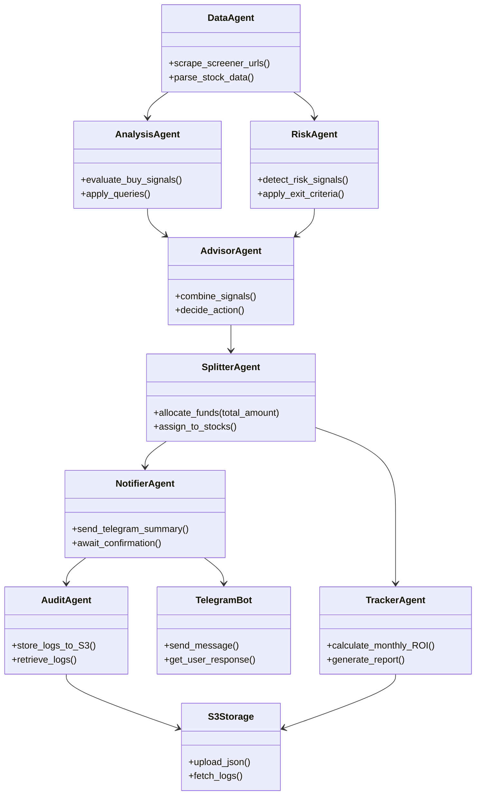
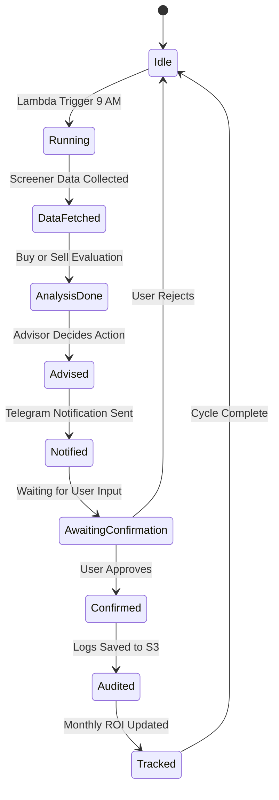

# 📈 Penny Stock Agentic AI

An agentic AI system that identifies potential multi-bagger penny stocks, allocates ₹1000 monthly across selected opportunities, sends Telegram notifications for manual approval, and logs all activity for performance tracking.

The goal is to minimize risk, capture early growth, and automate data analysis and tracking, with optional integration to Zerodha or Groww APIs for automated low-latency trading at market open.

## 🧠 System Overview

This system uses multiple collaborating agents, each focused on a specific function:

Agent	Purpose
Data Agent	Scrapes public Screener.in URLs and prepares stock data.
Analysis Agent	Applies buying criteria to identify potential multi-bagger stocks.
Risk Agent	Monitors risk and detects exit or overbought signals.
Advisor Agent	Combines analysis and risk data to decide BUY / HOLD / EXIT.
Splitter Agent	Allocates ₹1000 intelligently among shortlisted stocks.
Notifier Agent	Sends Telegram messages and waits for confirmation.
Audit Agent	Logs all actions to AWS S3 for audit and transparency.
Tracker Agent	Calculates monthly ROI and evaluates performance.
Trader Agent (Future)	Executes trades via Zerodha or Groww APIs (optional).
## ⚙️ Screener Queries

These queries are used as inputs to the Data Agent.

### Buy Query (Penny Stock — Careful + Profit Mindset):

```sql
Current price < 20 AND
Market Capitalization > 100 AND
Promoter holding > 30 AND
Debt to equity < 1.5 AND
Volume > 75000 AND
Current price > DMA 200 AND
DMA 50 > DMA 200
```


### Sell / Exit Watchlist Query (Momentum Broken):

```sql
Current price < DMA 200 OR
Current price < DMA 50
```

### Avoid / Warning Query (Overstretched / Risk Zone):

```sql
Current price > (1.5 * DMA 200)
```
---
## 🔄 System Architecture



---

## 🧩 UML Sequence Diagram — Agent Flow


---
## 🧱 UML Class Diagram — Agent Components


---
## 🔁 UML State Diagram — System Lifecycle


---

### ☁️ Deployment & Hosting
|Option|Description|Free Tier| 
|---|---|---|
AWS Lambda| Run workflow on cron schedule	| ✅ 1M free requests/month | 
AWS S3| Store audit logs	| ✅ 5 GB free | 
n8n (self-host)	| Local or EC2 orchestration	| ✅ Free on EC2 free tier | 
CrewAI (Python)	| Orchestrate agents programmatically	| ✅ Open source | 
Telegram Bot API	| For notifications	| ✅ Free | 
GitHub Actions	| Optional trigger / CI	| ✅ Free | 

### 📦 Future Enhancements

#### 🔌 Integrate Zerodha Kite Connect or Groww API for real trade execution.
#### 📊 Add real-time dashboards for ROI tracking.
#### 🧠 Fine-tune prompts with LLMs for adaptive query tuning.
#### 🧮 Build dynamic fund allocation models using historical performance data.
